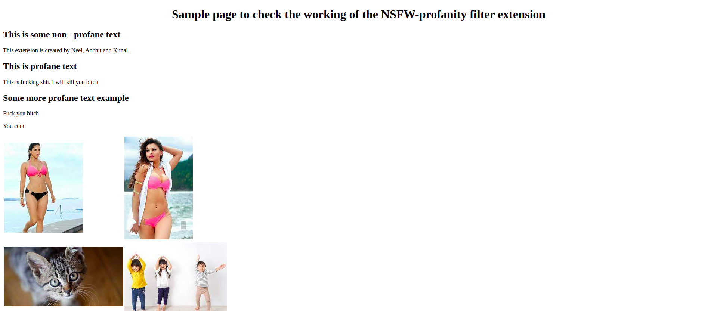
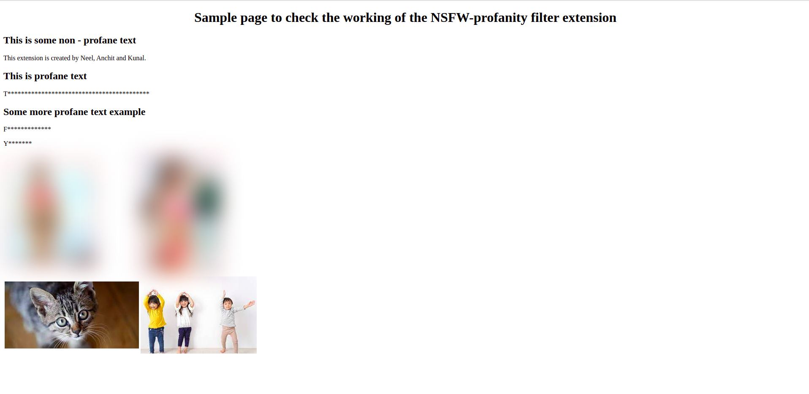

# NSFW and Profanity filter

This repository contains the code for the Scoial computing course project. This project focuses on creating a browser extension which will filter NSFW and profane content from the webpages using deep learning.

## Demo Video [Link](https://www.youtube.com/watch?v=RL2RHBe13VU) 

## Team

- Neel Trivedi
- Anchit Gupta
- Kunal Vaswani

<hr/>


# Training and Deep learning

## NSFW classifier

To know more about NSFW Image classfier, go [here](NSFW_classifier).

## Profanity Detector

To know more about Profanity detector, go [here](Profanity_detector).

<hr/>

# Browser Extension

There are two extensions:

1. NSFW images filter
2. Profanity text filter

### NSFW images filter:

This filter will blur all the NSFW images from the webpages. To use this filter with your own browser, enable <b>Developer Mode</b> in Chrome's extensions window and then click on <b>Load Unpacked</b> and then select [this folder](extension/NSFW_extension).

To use your own pretrained models, change the `model.json` and .bin files [here](extension/NSFW_extension/models/)

### Profanity Filter:

To use the profanity filter you will have to deploy a simple flask server either locally or on a remote server.

To run the flask server go to, `extension/profane_extension/server` and execute,

```
> python3 app.py
```

Once the server is running replace the url of the server in [background.js](extension/profane_extension/extension/background.js) and then just like the NSFW filter load this package to chrome browser.

<i>Since chrome doesn't allow communicating with insecure(http) server, the flask server must be running on HTTPS. for this you can either use nginx or ngrok. We used ngrok</i>

# Results

<table>
<tr>
    <td><b>Without
    Extension</b></td>
    <td></td>
</tr>
<tr>
      <td><b>With
      Extension</b></td>
    <td></td>
</tr>

</table>
